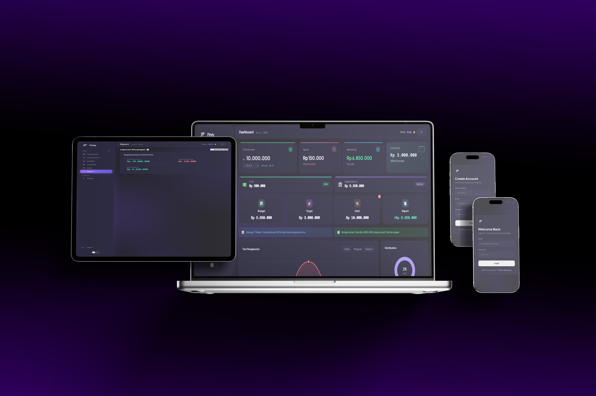

# 💸 Finly — Smart Budget Planner & Debt Tracker



> **Finly** adalah aplikasi pengelolaan keuangan berbasis Progressive Web App (PWA) yang proaktif, pintar, dan siap digunakan secara offline. Didesain khusus untuk membantu Anda melacak arus kas harian, mengelola target tabungan, dan memantau status utang-piutang dalam satu *dashboard* yang modern dan responsif.

🔗 **[Live Demo](https://queen-hash.github.io/Finly-Budget-Planner/)** | 👨‍💻 **[Portfolio Saya](https://queen-hash.github.io/Portfolio/)**

✨ Fitur Utama
- **Real-time Dashboard:** Pantau Total Pemasukan, Pengeluaran, Sisa Budget, dan Tabungan secara instan dengan indikator visual dan grafik analitik (Donut & Bar Chart).
- **Manajemen Kategori & Tabungan:** Alokasikan *budget* untuk setiap kategori pengeluaran dan lacak perkembangan tabungan lengkap dengan simulasi persentase bunga.
- **Sistem Manajemen Utang:** Catat utang-piutang, atur tenggat waktu, dan dapatkan *badge* peringatan otomatis saat utang mendekati batas jatuh tempo.
- **Smart Insights & Notifikasi:** Aplikasi akan memberikan *insight* pintar jika pengeluaran Anda hampir mencapai limit atau *overbudget*.
- **Laporan Komprehensif:** Fitur ekspor laporan keuangan dalam format **PDF** dan riwayat transaksi dalam format **CSV**.
- **Dark / Light Mode:** Sesuaikan kenyamanan mata Anda dengan transisi tema yang mulus.
- **Offline-Ready (PWA):** Finly dapat diinstal langsung ke *Homescreen* (Mobile/Desktop) dan beroperasi sepenuhnya tanpa koneksi internet dengan memanfaatkan teknologi Service Worker dan `localStorage`.
- **Keamanan Data (Backup & Restore):** Kendali penuh atas data Anda. Ekspor seluruh riwayat transaksi sebagai format `JSON` dan *restore* kapan pun dibutuhkan.

🛠️ Teknologi yang Digunakan

Aplikasi ini dibangun murni menggunakan teknologi *web* fundamental tanpa mengandalkan *framework* berat (seperti React/Vue), guna memastikan performa yang cepat, ukuran ringan, dan pengalaman *loading* yang instan.

- **HTML5** (Semantik & Struktur)
- **CSS3** (Flexbox, Grid, CSS Variables, & Custom Animations)
- **Vanilla JavaScript** (ES6+, DOM Manipulation, LocalStorage API)
- **Service Worker & Manifest** (PWA Capability)
- *Library Eksternal:* `jsPDF` & `jsPDF-AutoTable` (Hanya digunakan untuk fitur ekspor laporan PDF).

## 🚀 Cara Menjalankan Secara Lokal

Jika Anda ingin menjalankan, bereksperimen, atau memodifikasi *project* ini di mesin lokal Anda:

1. **Clone repositori ini:**
   ```bash
   git clone [https://github.com/Queen-hash/Finly-Budget-Planner.git](https://github.com/Queen-hash/Finly-Budget-Planner.git)
2. **Masuk ke direktori project:**
   ```bash
   cd Finly-Budget-Planner
3. Jalankan Aplikasi:
    Buka file index.html menggunakan web browser Anda, atau gunakan ekstensi seperti Live Server di VSCode untuk pengalaman development terbaik.
4. Voila! Finly siap digunakan.


📂 Struktur Direktori
  
      📦 Finly-Budget-Planner
     ┣ 📜 index.html         # Struktur UI Utama
     ┣ 📜 style.css          # Styling & Tema (Dark/Light)
     ┣ 📜 script.js          # Logika Aplikasi, State Management, & DOM
     ┣ 📜 manifest.json      # Konfigurasi Progressive Web App (PWA)
     ┣ 📜 service-worker.js  # Konfigurasi Offline Caching
     ┣ 🖼️ logo.png           # Logo Brand Finly
     ┗ 🖼️ favicon.png        # Web Icon
     
🤝 Kontribusi
Aplikasi ini dibuat sebagai salah satu proyek portofolio pribadi. 
Jika Anda memiliki saran, menemukan bug, atau ingin berkontribusi menambah fitur baru, jangan ragu untuk membuat 
Pull Request atau membuka Issue.

📞 Kontak & Profil
Didesain dan dikembangkan dengan ❤️ oleh Munawardy (DY).

📸 Instagram: @_nrrdyy

💼 LinkedIn: Munawardy

📧 Email: wincakardi.040105@gmail.com

🌐 Website: dy.dev
